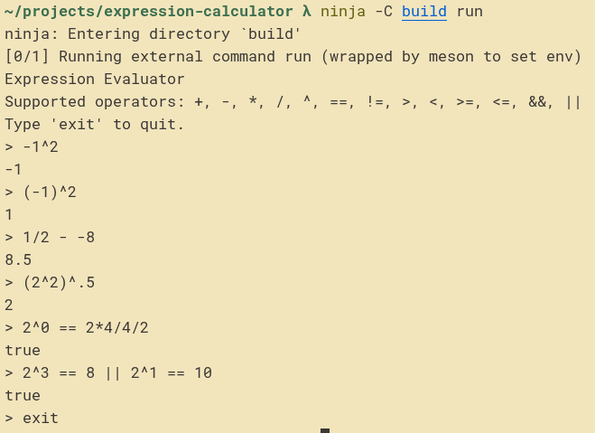

# expression-calculator

A small expression calculator that tokenizes an input string, converts it to postfix using the shunting-yard algorithm, and evaluates the postfix expression.

Originally written as a school project with constraints (no standard library; lexer/parser/evaluator implemented as classes; and `Queue`/`Stack` implemented via private inheritance from a supplied linked list class). I modernized it into a C++20 project built with Meson.

## Supported syntax

-   Numbers: integers and floats (e.g. `12`, `3.14`, `.5`)
-   Booleans: `true`, `false`
-   Parentheses: `(`, `)`
-   Operators:
    -   Arithmetic: `+`, `-`, `*`, `/`, `^`
    -   Comparison: `==`, `!=`, `>`, `<`, `>=`, `<=`
    -   Logical: `&&`, `||`
    -   Unary minus: `-` (when used in operand position)

Strict type rules:

-   Arithmetic/comparison operators require numbers.
-   Logical operators require booleans.
-   Equality/inequality require both operands to have the same type.

## Example usage



## Build

```sh
meson setup build
meson compile -C build
```

## Run

```sh
ninja -C build run
```

## Tests

```sh
meson test -C build --print-errorlogs
```
